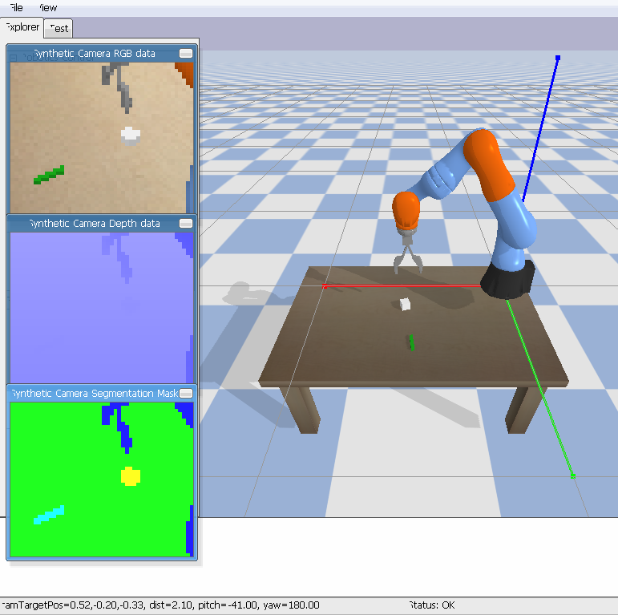
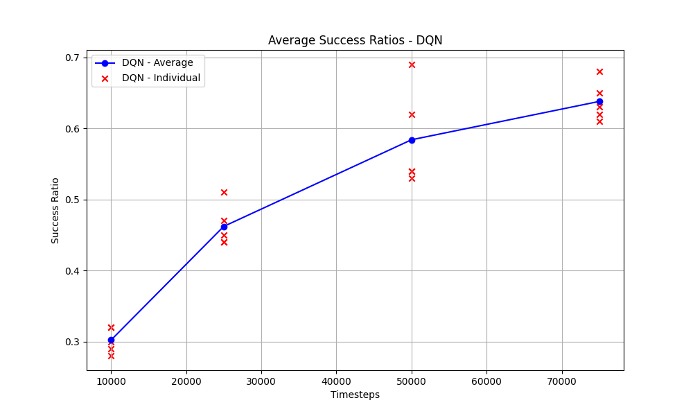

# RL-based Top-down Robot Grasping
Reinforcement Learning for Targeted 3D Object Top-Down Grasping with Emphasis on Selective Shape Manipulation

## About the Project
In this project, the main goal is to explore reinforcement learning algorithms and apply these algorithms to pick up specific shaped objects. While exploring the pybullet library, a few [examples](https://github.com/bulletphysics/bullet3/blob/master/examples/pybullet/gym/pybullet_envs/bullet/kuka_diverse_object_gym_env.py) have been used as a reference point. The setup is based on one of these examples that has a Kuka Robot arm and a sample [OpenAI's Gym](https://github.com/openai/gym) environment. The reward function computes the rewards if the user-specified object is picked up; otherwise, if another object is grasped, a penalty is applied. Specific shapes like cube and cuboid are added for the robot arm to attempt pickups.

A sample Demo([Demo.mp4](https://github.com/vedangwartikar/reinforced-robot-grasping/blob/master/Demo.mp4)) is available in the root dir, but the simulation environment looks like -

<p align="center">
  
</p>

## How to Execute

### Files
The `environment.yml` (created from our conda env) contains all the requirements needed to run this project.

For training the DQN / DDPG model, `config.json` should be modified. For example, if the user wants to train the DQN model on a cube for **25,000** timesteps, the following configuration is required:
- `specific_object`: cube_small.urdf
- `algorithm`: DQN
- `timesteps`: 25000

After this, one can execute the training by running:
```bash
python train.py
```
For testing a model, on say 100 timesteps, following changes in the config.json are needed:

`model_dir`: ../models/DQN_75k_cube/best_model.zip, </br>
`test_episodes`: 100

After this, one can execute the testing by running:

```bash
python test.py
```
This will print out the success ratio of the 100 grasp attempts. Since the training of most of the models takes more than 10+ hours, we have added a few models so that it's easy to test on those - **DDPG (10k, 25k)** and **DQN (10k, 25k, 50k, 75k)** timesteps.

The script `plot.py` plots the average success ratios of the DQN model from the metrics.csv which is generated by `test.py`.

For the RL algorithm DQN, the plot for avg success ratios vs the timestamps (10k, 25k, 50k and 75k) looks like  -

<p align="center">
  
</p>

----

Feel free to contribute through a PR or report any issue.
